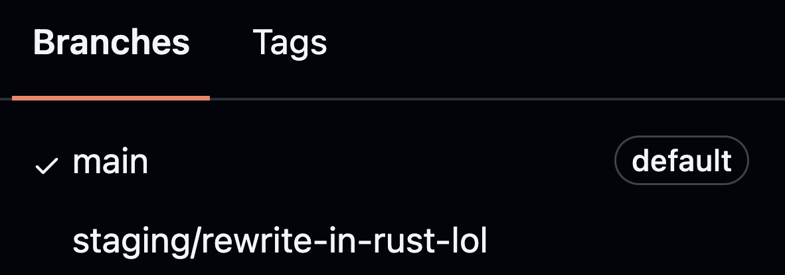

# How do we teach a community that's teaching themselves?

# First, a onfession
<!-- Typewriter: native auto-animate chain. Intermediates auto-advance
     (data-autoslide) and are uncounted; final slide has no autoslide, so the
     effect types once and stops. -->

# For me, learning started here {.typewriter auto-animate=true auto-animate-duration="0.1" auto-animate-unmatched="false" data-autoslide="200" visibility="uncounted"}

```{.r data-id="tw"}
>
```

# For me, learning started here {.typewriter auto-animate=true auto-animate-duration="0.1" auto-animate-unmatched="false" data-autoslide="200" visibility="uncounted"}

```{.r data-id="tw"}
> l
```

# For me, learning started here {.typewriter auto-animate=true auto-animate-duration="0.1" auto-animate-unmatched="false" data-autoslide="200" visibility="uncounted"}

```{.r data-id="tw"}
> lib
```

# For me, learning started here {.typewriter auto-animate=true auto-animate-duration="0.1" auto-animate-unmatched="false" data-autoslide="200" visibility="uncounted"}

```{.r data-id="tw"}
> libr
```

# For me, learning started here {.typewriter auto-animate=true auto-animate-duration="0.1" auto-animate-unmatched="false" data-autoslide="200" visibility="uncounted"}

```{.r data-id="tw"}
> libra
```

# For me, learning started here {.typewriter auto-animate=true auto-animate-duration="0.1" auto-animate-unmatched="false" data-autoslide="200" visibility="uncounted"}

```{.r data-id="tw"}
> librar
```

# For me, learning started here {.typewriter auto-animate=true auto-animate-duration="0.1" auto-animate-unmatched="false" data-autoslide="200" visibility="uncounted"}

```{.r data-id="tw"}
> library
```

# For me, learning started here {.typewriter auto-animate=true auto-animate-duration="0.1" auto-animate-unmatched="false" data-autoslide="200" visibility="uncounted"}

```{.r data-id="tw"}
> library(
```

# For me, learning started here {.typewriter auto-animate=true auto-animate-duration="0.1" auto-animate-unmatched="false" data-autoslide="200" visibility="uncounted"}

```{.r data-id="tw"}
> library("
```

# For me, learning started here {.typewriter auto-animate=true auto-animate-duration="0.1" auto-animate-unmatched="false" data-autoslide="200" visibility="uncounted"}

```{.r data-id="tw"}
> library("s
```

# For me, learning started here {.typewriter auto-animate=true auto-animate-duration="0.1" auto-animate-unmatched="false" data-autoslide="200" visibility="uncounted"}

```{.r data-id="tw"}
> library("sw
```

# For me, learning started here {.typewriter auto-animate=true auto-animate-duration="0.1" auto-animate-unmatched="false" data-autoslide="200" visibility="uncounted"}

```{.r data-id="tw"}
> library("swi
```

# For me, learning started here {.typewriter auto-animate=true auto-animate-duration="0.1" auto-animate-unmatched="false" data-autoslide="200" visibility="uncounted"}

```{.r data-id="tw"}
> library("swir
```

# For me, learning started here {.typewriter auto-animate=true auto-animate-duration="0.1" auto-animate-unmatched="false" data-autoslide="200" visibility="uncounted"}

```{.r data-id="tw"}
> library("swirl
```

# For me, learning started here {.typewriter auto-animate=true auto-animate-duration="0.1" auto-animate-unmatched="false" data-autoslide="200" visibility="uncounted"}

```{.r data-id="tw"}
> library("swirl"
```

# For me, learning started here {.typewriter auto-animate=true auto-animate-duration="0.1" auto-animate-unmatched="false" data-autoslide="200" visibility="uncounted"}

```{.r data-id="tw"}
> library("swirl")
```

# For me, learning started here {.typewriter auto-animate=true auto-animate-duration="0.1" auto-animate-unmatched="false" data-autoslide="200" visibility="uncounted"}

```{.r data-id="tw"}
> library("swirl")
>
```

# For me, learning started here {.typewriter auto-animate=true auto-animate-duration="0.1" auto-animate-unmatched="false" data-autoslide="200" visibility="uncounted"}

```{.r data-id="tw"}
> library("swirl")
> s
```

# For me, learning started here {.typewriter auto-animate=true auto-animate-duration="0.1" auto-animate-unmatched="false" data-autoslide="200" visibility="uncounted"}

```{.r data-id="tw"}
> library("swirl")
> sw
```

# For me, learning started here {.typewriter auto-animate=true auto-animate-duration="0.1" auto-animate-unmatched="false" data-autoslide="200" visibility="uncounted"}

```{.r data-id="tw"}
> library("swirl")
> swi
```

# For me, learning started here {.typewriter auto-animate=true auto-animate-duration="0.1" auto-animate-unmatched="false" data-autoslide="200" visibility="uncounted"}

```{.r data-id="tw"}
> library("swirl")
> swir
```

# For me, learning started here {.typewriter auto-animate=true auto-animate-duration="0.1" auto-animate-unmatched="false" data-autoslide="200" visibility="uncounted"}

```{.r data-id="tw"}
> library("swirl")
> swirl
```

# For me, learning started here {.typewriter auto-animate=true auto-animate-duration="0.1" auto-animate-unmatched="false" data-autoslide="200" visibility="uncounted"}

```{.r data-id="tw"}
> library("swirl")
> swirl(
```

# For me, learning started here {.typewriter auto-animate=true auto-animate-duration="0.1" auto-animate-unmatched="false"}

```{.r data-id="tw"}
> library("swirl")
> swirl()
```

# Interactive feedback in IDE 

<!-- Chunk-by-chunk reveal: three code blocks styled as one console via
     .swirl-console; the answer and response appear as fragments. -->

::: {.swirl-console}

```{.r code-line-numbers="false"}
| Create a function that adds a and b 


```

::: {.fragment}
```{.r code-line-numbers="false"}
> add <- function(a, b) {a + b} 


```
:::

::: {.fragment}
```{.r code-line-numbers="false"}
| All that hard work is paying off!
```
:::

:::

## learnr: a step into the browser

<video data-autoplay muted playsinline controls src="media/learnr_screen_recording.mp4" style="display: block; margin: 0 auto; max-height: 480px; max-width: 100%; border-radius: 8px;"></video>

## learnr wasn't just R!

<video data-autoplay muted playsinline controls src="media/learnr_sql_correct.mp4" style="display: block; margin: 0 auto; max-height: 480px; max-width: 100%; border-radius: 8px;"></video>

# But we want more

<!-- Image slides: bare image first, then the same image with a centered
     .image-label box (styled in custom.scss). -->

## {background-image="media/railroad_generalized.jpg"}

## {background-image="media/railroad_generalized.jpg"}

::: {.image-label}
Deterministic
:::

## {background-image="media/river_delta_dynamic.jpg"}

## {background-image="media/river_delta_dynamic.jpg"}

::: {.image-label}
Dynamic
:::

## {background-image="media/crowd.jpg"}

## {background-image="media/crowd.jpg"}

::: {.image-label}
General
:::

## {background-image="media/crowd_personalized.jpg"}

## {background-image="media/crowd_personalized.jpg"}

::: {.image-label}
Personalized
:::

<!-- media/pipe.svg: native pipe drawn as vector shapes in the deck's colors. -->

## {background-image="media/pipe.svg" background-size="cover" background-color="#1a1a1e"}

## {background-image="media/pipe.svg" background-size="cover" background-color="#1a1a1e"}

::: {.image-label}
Pipe dream?
:::

## hello, blendtutor

<video data-autoplay muted playsinline controls src="media/blendtutor_feedback_example.mp4" style="display: block; margin: 0 auto; max-height: 480px; max-width: 100%; border-radius: 8px;"></video>

# Let me show the whole game

# Install = one binary, no deps 

# The meme, but actually {.v-center}

{fig-align="center"}

# Make a course 

```bash
blendtutor init hello-course
```

::: {.fragment}
[A working lesson [and]{.accent} its evals, out of the box.]{.muted}
:::

# A lesson is a YAML file

## This is a working example

```yaml
lesson_name: "Hello, blendtutor"
language: R
exercise:
  type: "function_writing"
  prompt: |
    Write R code that prints "hello"
  success_criteria: |
    - Prints exactly the word "hello"
  llm_evaluation_prompt: |
    Grade a beginner R exercise: print "hello" 
    The student submitted: {student_code}
```

# Add your own 

<!-- Line-by-line reveal: one code block per line inside .code-steps, which
     styles them as a single box (custom.scss). -->

::: {.code-steps}

::: {.fragment}
```{.bash code-line-numbers="false"}
blendtutor new lesson --lang r greet
```
:::

::: {.fragment}
```{.bash code-line-numbers="false"}
blendtutor validate lessons/greet.yaml
```
:::

::: {.fragment}
```{.bash code-line-numbers="false"}
blendtutor run lessons/greet.yaml --code sub.R
```
:::

:::

::: {.fragment}
[Author, check, try — before a student ever sees it.]{.accent}
:::

# Evals = necessary

# But they're so complicated...

# Just kidding, one more YAML

```yaml
cases:
  - submission: |-
      cat("hello\n")
    expected: correct
  - submission: |-
      cat("goodbye\n")
    expected: incorrect
```
# Run with a single command

```bash
blendtutor eval lesson_hello.yaml
```

# Ship a static site 

```bash
blendtutor build hello-course --target webr -o site
```


[`--target pyodide` for Python.]{.muted}

<!-- DEMO SLOT: recording of the built webr site — student submits a wrong
     answer, gets feedback, fixes it. Strongest demo in the deck. -->

<!-- Built static site screenshot (1686x1382, taller than 3:2): shown whole,
     padded with its own #1e1e1e so the edges disappear. -->

## {background-image="media/blendtutor_static_site_example.png" background-size="contain" background-color="#1e1e1e"}

# Or drop it into Quarto 

```bash
quarto add mcmullarkey/blendtutor
blendtutor export-quarto lesson_hello.yaml
```
## Auto-generated or by hand

````markdown
---
filters: [mcmullarkey/blendtutor]
---

::: {.blendtutor language="r"}
Write a function `add(a, b)` that returns the sum.

```r
add <- function(a, b) { ___ }
```
:::
````
# Curious but overwhelmed?

## The repo has a skill

<video data-autoplay muted playsinline controls src="media/blendtutor_course_skill_demo.mp4" style="display: block; margin: 0 auto; max-height: 480px; max-width: 100%; border-radius: 8px;"></video>

## Two asks {.v-center}

:::: {.columns .cta}

::: {.column width="50%"}
### Try blendtutor

{.qr}

[github.com/mcmullarkey/blendtutor]{.muted}
:::

::: {.column width="50%"}
### Subscribe to Data Dash

{.qr}

[buttondown.com/datadash]{.muted}
:::

::::


